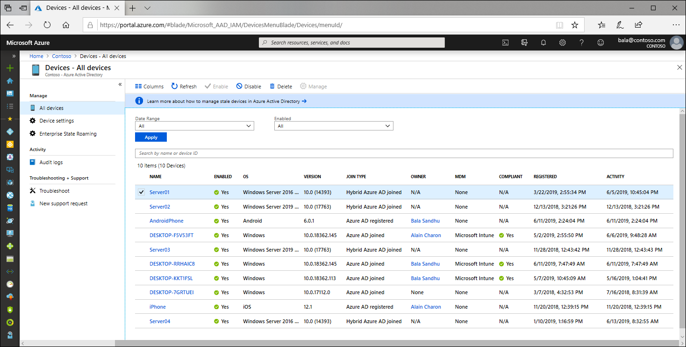

# What is a device identity?

With the proliferation of devices of all shapes and sizes and the Bring Your Own Device (BYOD) concept, IT professionals are faced with two somewhat opposing goals:

- Allow end users to be productive wherever and whenever
- Protect the organization's assets

To protect these assets, IT staff need to first manage the device identities. IT staff can build on the device identity with tools like Microsoft Intune to ensure standards for security and compliance are met. Azure Active Directory (Azure AD) enables single sign-on to devices, apps, and services from anywhere through these devices.

- Your users get access to your organization's assets they need. 
- Your IT staff get the controls they need to secure your organization.

Device identity management is the foundation for [device-based conditional access](../conditional-access/require-managed-devices.md). With device-based conditional access policies, you can ensure that access to resources in your environment is only possible with managed devices.

## Getting devices in Azure AD

To get a device in Azure AD, you have multiple options:

- **Azure AD registered**
   - Devices that are Azure AD registered are typically personally owned or mobile devices, and are signed into with a personal Microsoft account or another local account.
      - Windows 10
      - iOS
      - Android
      - MacOS
- **Azure AD joined**
   - Devices that are Azure AD joined are owned by an organization, and are signed in to with an Azure AD account belonging to that organization. They exist only in the cloud.
      - Windows 10 
- **Hybrid Azure AD joined**
   - Devices that are hybrid Azure AD joined are owned by an organization, and are signed in to with an Azure AD account belonging to that organization. They exist in the cloud and 
      - Windows 7, 8.1, or 10
      - Windows Server 2008 or newer

## Device management

Devices in Azure AD can be managed using Mobile Device Management (MDM) tools like Microsoft Intune, System Center Configuration Manager, Group Policy (hybrid Azure AD join), Mobile Application Management (MAM) tools, or other third-party tools.

## Resource access

Registering and joining give your users Seamless Sign-on (SSO) to cloud resources and administrators the ability to apply Conditional Access policies to those resources. 

Devices that are Azure AD joined or hybrid Azure AD joined benefit from SSO to your organization's on-premises resources as well as cloud resources. More information can be found in the article, [How SSO to on-premises resources works on Azure AD joined devices](azuread-join-sso.md).

## Device security

- **Azure AD registered devices** utilize an account managed by the end user, this account is either a Microsoft account or another locally managed credential secured with one or more of the following.
   - Password
   - PIN
   - Pattern
   - Windows Hello
- **Azure AD joined or hybrid Azure AD joined devices** utilize an organizational account in Azure AD secured with one or more of the following.
   - Password
   - Windows Hello for Business

## Provisioning

Getting devices in to Azure AD can be done in a self-service manner or a controlled provisioning process by administrators.

## Summary

With device identity management in Azure AD, you can:

- Simplify the process of bringing and managing devices in Azure AD
- Provide your users with an easy to use access to your organization’s cloud-based resources

## License requirements

[!INCLUDE [Active Directory P1 license](../../../includes/active-directory-p1-license.md)]

## Next steps

- Learn more about [Azure AD registered devices](concept-azure-ad-register.md)
- Learn more about [Azure AD joined devices](concept-azure-ad-join.md)
- Learn more about [hybrid Azure AD joined devices](concept-azure-ad-join-hybrid.md)

- To get an overview of how to manage device identities in the Azure portal, see [Managing device identities using the Azure portal](device-management-azure-portal.md).
- To set up:
   - Azure Active Directory registered Windows 10 devices, see [How to configure Azure Active Directory registered Windows 10 devices](../user-help/device-management-azuread-registered-devices-windows10-setup.md).
   - Azure Active Directory joined devices, see [How to plan your Azure Active Directory join implementation](azureadjoin-plan.md).
   - Hybrid Azure AD joined devices, see [How to plan your hybrid Azure Active Directory join implementation](hybrid-azuread-join-plan.md).
- To learn more about device-based conditional access, see [Configure Azure Active Directory device-based conditional access policies](../conditional-access/require-managed-devices.md).
